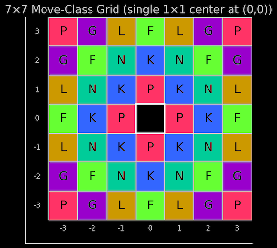
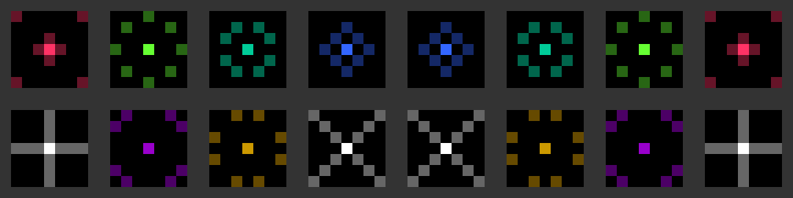
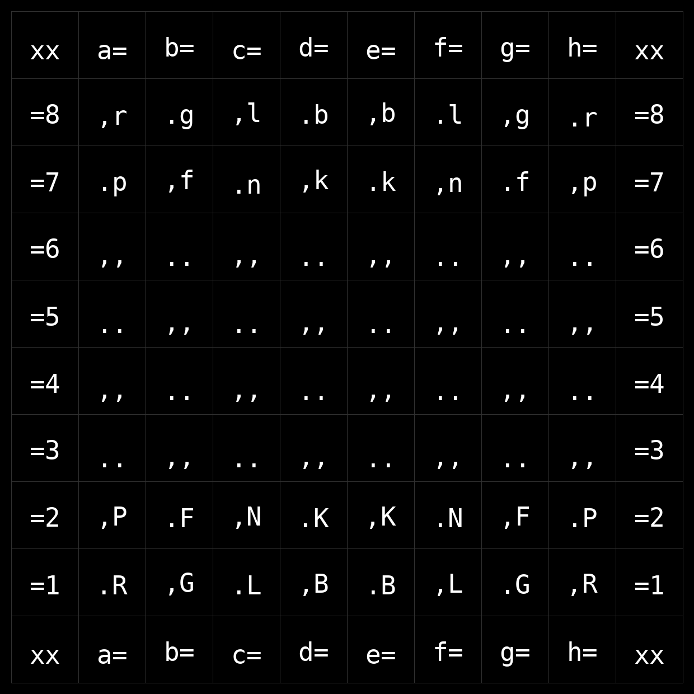

# Battledance Chess + MLP-GA Trainer

This repository contains two connected things:

1. **Battledance Chess** — a custom chesslike board game.
2. **A neural-network trainer** — a long-running program that tries to evolve computer players for that game.

The trainer does not use human game records, opening books, or hand-written strategy. It creates many simple neural networks, lets them play Battledance Chess, keeps the better performers, mixes and mutates them, and repeats.

In one line:

```text
Battledance Chess is the game; the MLP-GA trainer is the experiment that breeds neural players for it.
```

This is experimental toy/research code. It is meant to run for a long time, save progress often, and resume after ordinary interruptions.

---

## Battledance Chess in plain English

Battledance Chess is played on an **8×8 board**. It looks chesslike, but the pieces and rules are custom.

Each player starts with two rows of pieces:

```text
xx a= b= c= d= e= f= g= h= xx
=8 ,r .g ,l .b ,b .l ,g .r =8
=7 .p ,f .n ,k .k ,n .f ,p =7
=6 ,, .. ,, .. ,, .. ,, .. =6
=5 .. ,, .. ,, .. ,, .. ,, =5
=4 ,, .. ,, .. ,, .. ,, .. =4
=3 .. ,, .. ,, .. ,, .. ,, =3
=2 ,P .F ,N .K ,K .N ,F .P =2
=1 .R ,G .L ,B .B ,L .G ,R =1
xx a= b= c= d= e= f= g= h= xx
```

Uppercase pieces are **White**. Lowercase pieces are **Black**.

The leading `.` and `,` characters are only square-color markers for the text board. For example, `.K` means a `K` piece on one square color, `,K` means a `K` piece on the other square color, and `..` or `,,` means an empty square.

The internal starting-position string is:

```text
rglbblgr/pfnkknfp/8/8/8/8/PFNKKNFP/RGLBBLGR w - - 0 1
```

---

## Objective

The **Bishop** is royal. You may not expose either of your own bishops to opponent check, or leave them in unaddressed check when your opponent attacks them.

A player loses if they have no legal moves; unlike regular chess, stalemate is a loss, not a draw.

---

## Pieces and movement

Most pieces are **leapers**. A leaper jumps directly to its destination. It may land on an empty square or capture an enemy piece. It may not land on a friendly piece.

Movement pairs such as `(2,1)` describe a jump shape: two squares in one direction and one square sideways. Leap directions are symmetric, so `(2,1)` includes every reflected and rotated version of that jump, like a chess knight.

| Letter | Name | Movement |
|---|---|---|
| `K` | Kirin | Leaps `(2,0)` and `(1,1)` |
| `N` | kNight | Leaps `(2,1)` |
| `F` | Frog | Leaps `(3,0)` and `(2,2)` |
| `L` | Lancer | Leaps `(3,1)` |
| `P` | Phoenix | Leaps `(1,0)` and `(3,3)` |
| `G` | roGue | Leaps `(3,2)` |
| `R` | Rook | Slides orthogonally, like a chess rook |
| `B` | Bishop | Slides diagonally, like a chess bishop; also royal |

A sliding piece keeps moving in a straight legal direction until it stops, captures, is blocked, or reaches the edge of the board.

The small 7×7 movement grid in this repository is a visual reference for the short-range leap classes, centered on `(0,0)`. It is not the game board.





---

## Check, captures, and drops

A side may not make a move that leaves its own Bishop attacked. Because each side starts with two Bishops, both royal Bishops matter.

When a player captures a **non-Bishop** piece, that piece goes into the capturing player’s hand.

On a later turn, instead of moving a board piece, the player may **drop** one held piece onto an empty square in their own home rows:

```text
White home rows: ranks 1 and 2
Black home rows: ranks 7 and 8
```

Drops do not capture. They simply place a held piece back onto the board.

---

## Draws

The engine declares a draw by any of these rules:

```text
threefold repetition
128 plies without a capture or drop
4096 total plies
```

A **ply** is one turn by one player. So 128 plies equals 64 full moves.

---

## What the neural player does

Each neural network is a board evaluator.

It does not understand the rules in words. The program converts the board into numbers, gives those numbers to the network, and receives one score back.

The default board encoding has **594 numbers**:

```text
piece locations
pieces in hand
side to move
draw and repetition counters
```

More exactly, the board portion uses 9 separate 8×8 planes: one plane for each of the 8 piece types, plus one aggregate occupancy/color plane. The remaining inputs encode pieces in hand, side to move, and draw/repetition counters.

The default network shape is:

```text
594 -> 512 -> 512 -> 512 -> 1
```

That means:

```text
594 input numbers
three hidden layers of 512 values each
1 output score
```

The network uses `tanh`, which keeps layer values in a smooth `-1` to `+1` range.

When choosing a move, the agent:

1. lists all legal moves;
2. temporarily plays each move;
3. evaluates the resulting board;
4. gives immediate wins a huge score;
5. treats terminal draws as neutral;
6. randomly chooses among the high-scoring moves, weighted toward the better ones.

For move choice, **normalized** means relative to the legal moves in the current position. The worst-scored legal move becomes `0`, the best-scored legal move becomes `1`, and the rest fall between them. The agent then chooses from moves above the configured threshold, weighted toward the higher normalized scores. If all legal moves are effectively tied, it chooses randomly.

It is not doing deep chess-engine search. It is using one-move lookahead plus its learned board evaluator.

The random weighted choice matters: repeated games between the same two networks can still differ.

---

## Neuroevolution, without jargon

This trainer does **not** use backpropagation. It does not know the “correct” move for a position.

Instead, it uses survival pressure:

```text
make many networks
let them play games
score their results
keep the better ones
make children from them
mutate the children
repeat
```

That is the **GA**, or Genetic Algorithm, part.

The networks are not alive. “Genetic” just means the program treats each network’s weights and biases like inheritable numbers.

Common terms in this project:

| Term | Meaning here |
|---|---|
| **Network** | A board-scoring function made of many numeric weights and biases. |
| **Population** | A group of candidate networks being tested. |
| **Fitness** | How well a candidate performs in games. |
| **Selection** | Keeping the better candidates as parents. |
| **Crossover** | Building a child by taking values from two parents. |
| **Mutation** | Randomly nudging some values in the child. |
| **Elite** | A strong parent copied forward directly. |
| **Snapshot** | A saved network or saved parent set from a past point in training. |

The aim is simple: networks that perform better are more likely to influence the next generation.

---

## What a training run looks like

A fresh run starts with a **prelude**.

The prelude creates fresh Xavier-initialized seed networks, makes them play a seed round-robin, ranks them, and distributes them into the starting snapshot history.

With the default configuration:

```text
15 agents × 4 retained non-_0 snapshots = 60 prelude seed networks
```

After prelude, training proceeds in cycles.

A cycle roughly does this:

1. Train each agent against its configured opponent snapshots.
2. Evaluate each agent’s candidate networks.
3. Save a passing parent set when that agent succeeds.
4. Log champion audit games for that agent.
5. Once every agent is done, rotate snapshots.
6. Optionally run a cycle-end champion round-robin.
7. Advance the cycle counter.

The optional cycle-end champion round-robin writes the full game log, a white-perspective margin matrix, one representative game per directed matchup cell, a human-readable report, and a summary JSON file. Representative games prefer the modal result class; if the modal result is tied, Black win is preferred over White win, and White win is preferred over draw. A draw is selected only when it is strictly the modal result.

If the program stops before the cycle counter advances, running it again resumes the unfinished work instead of treating the cycle as complete.

---

## Agents and snapshots

The default run has 15 named training lineages:

```text
Red, Grn, Blu, Cyn, Mag, Yel, NoN, deR, nrG, ulB, nyC, gaM, leY, XyZ, ZyX
```

You do not need to know the naming theme to understand the trainer. Each name is just one evolving player lineage.

Each agent has snapshot slots:

```text
Name_0.bdpop   Active training population or current parent checkpoint.
Name_1.bdpop   Most recent retained trained parents.
Name_2.bdpop   Older retained champion snapshot.
Name_3.bdpop   Older retained champion snapshot.
Name_4.bdpop   Older retained champion snapshot.
```

The `_0` slot is active during training. It may temporarily contain a full saved candidate population while a GA generation is in progress. After a successful generation, `_0` is pruned back down to the selected parent list.

The `_1` through `_4` slots are opponent history. Their file formats are intentionally not all the same:

```text
_1       parent-list payload
_2.._4   single-champion payloads
```

When the code needs a single champion from a parent-list file, it uses the first parent in the list. This is deliberate compatibility behavior, not proof that every snapshot file has the same internal format.

Snapshot files use the `.bdpop` format. It is a pickle-free ZIP container with JSON metadata and NumPy `.npy` numeric arrays loaded with `allow_pickle=False`. The trainer and local net-play server do not load `.pkl` models. Use `convert_pkl_to_bdpop.py` once for an old local run, then continue with `.bdpop` snapshots only.

Prelude also follows this layout. It writes `_0` and `_1` as identical parent lists made by cycling through that agent's four assigned prelude seeds. It writes `_2`, `_3`, and `_4` as single champion snapshots.

After a successful cycle, snapshots rotate:

```text
_0 selected parents -> _1 parent list
old _1 first parent -> _2 champion
old _2 champion     -> _3 champion
old _3 champion     -> _4 champion
old _4 champion     -> dropped
```

The rotation is plan-based and verified. If an interruption happens partway through rotation, the script uses its saved rotation plan rather than guessing from possibly half-rotated files.

---

## Population size and evaluation

The default population settings are:

```ini
[population]
parents = 8
children_per_parent_intersection = 4
elites = 4
```

That creates:

```text
8 × 8 × 4 = 256 children
256 children + 4 elite parent clones = 260 candidate networks
```

Evaluation happens in two stages:

```ini
[evaluation]
stage1_rounds = 2
stage2_finalists = 12
stage2_rounds = 16
```

Plain-English version:

```text
Stage 1: test every candidate with a smaller game budget.
Stage 2: spend more games only on the best finalists.
```

For fitness ranking, **normalized** means relative to the candidates currently being compared. The worst value becomes `0`, the best value becomes `1`, and tied-all-equal values become `1` for everyone.

Normal fitness rewards both overall score and consistency:

```text
normalized(total margin) × normalized(minimum margin)
```

`total margin` rewards broad performance across all required opponent snapshots. `minimum margin` rewards avoiding a bad matchup against any one required opponent snapshot.

The success gate is stricter than the ranking score: the chosen parents must have non-negative margins against every required opponent snapshot at the configured evaluation depth. A candidate that is strong on average but clearly loses to one required opponent can fail the gate.

There is also a rare fallback mode that ranks by worst matchup first. With the default settings, it is only used after many unsuccessful generations.

---

## Running the trainer

Install dependencies:

```bash
pip install -r requirements.txt
```

The current dependency list is intentionally small:

```text
numpy>=1.24
```

Run the trainer:

```bash
python battledance_training.py
```

Request a graceful stop while it is running:

```text
q
```

On some terminals, type `q` and then Enter. The program finishes the current game, saves progress, and exits without pretending the current cycle is complete.

To resume, run the same command again:

```bash
python battledance_training.py
```

Useful optional commands:

```bash
python battledance_training.py --threads-mode 5
python battledance_training.py --prelude-workers 5
python battledance_training.py --prelude-rounds 8
python -S -m py_compile battledance_training.py
```

---

## Browser play and local net play

This repository also includes browser GUIs for trying the game outside the trainer.

For two-human local play, open:

```text
battledance_chess_android_gui_v09-bright.html
```

Despite the filename, it is just a browser HTML GUI. It is aimed at phone/tablet portrait play, but it can also be opened on desktop.

For human-vs-net local play, run the Python server from the project folder:

```bash
python battledance_net_server.py
```

Then open the local address printed by the server, or use the included Windows helper:

```text
start_battledance_vs_net.bat
```

The net-play server serves:

```text
battledance_chess_vs_net.html
```

and lists local `.bdpop` snapshots under:

```text
models/
```

The local server is only meant for local play/testing. It is not a public web service.

The browser GUIs currently embed their board and piece images as base64 `data:` URLs inside the HTML files. Base64 is not a security feature; it is only a text encoding for bytes. In this repository it is used for convenience, so the GUIs can stay single-file and do not need separate image fetches. Treat embedded base64 from unknown sources the same way you would treat any other unknown file content.

---

## Converting old `.pkl` snapshots

Old local training runs may have pickle snapshot files. New code should use `.bdpop` snapshots instead.

To convert old local pickle files once:

```bash
python convert_pkl_to_bdpop.py
```

That scans `./models/**/*.pkl` and writes sibling `.bdpop` files.

To preview first:

```bash
python convert_pkl_to_bdpop.py --dry-run
```

To delete old pickle files after successful conversion:

```bash
python convert_pkl_to_bdpop.py --delete-pkl
```

Only run the converter on old pickle files you created locally. Pickle can execute code while loading, so do not convert `.pkl` models received from other people.

---

## Files in the repository

Core Python files:

```text
battledance_training.py       Game engine and training program.
battledance_net_server.py     Local browser-vs-net server.
convert_pkl_to_bdpop.py       One-shot old .pkl -> .bdpop converter.
```

Browser / launcher files:

```text
battledance_chess_android_gui_v09-bright.html   Two-human browser GUI.
battledance_chess_vs_net.html                   Browser GUI for local net play.
start_battledance_vs_net.bat                    Windows helper to launch the local server.
```

Configuration and project metadata:

```text
training_config.ini       Editable defaults for fresh runs.
requirements.txt          Python dependency list.
README.md                 This explanation.
LICENSE                   GPL-3.0-or-later license text.
.gitignore                Suggested ignores for generated files.
```

Visual reference / source image files:

```text
battledance-chess-move-display.png      7x7 move-class reference grid.
battledance_start_ascii_black_grid.png  Text-style starting-position reference.
concept.png                             Starting two-rank concept image.
chess_board.png                         Prototype board source image.
draob_ssehc.png                         Prototype board source image.
start_battledance_land.png              Start-screen landscape source image.
start_battledance_port.png              Start-screen portrait source image.
dnal_ecnadelttab_trats.png              Reversed-name landscape source image.
trop_ecnadelttab_trats.png              Reversed-name portrait source image.
```

Some image filenames are legacy/prototype names. Keep them as-is unless you are also updating any references that expect those names.

Runtime directories are created beside the script:

```text
models/        Model snapshots, training state, rotation state, and logs.
ga_progress/   Frequently updated progress JSON files.
sample_games/  Champion game logs, cycle round-robin logs, matrices,
               representative games, reports, and summary JSON files.
```

Move-history text emitted by the trainer and browser GUIs uses the same compact notation:

```text
001. Ke2-e4, Ph7xe4, 002. Nf2xe4+ Bd8-c7,
```

Each move token carries its own ending marker:

```text
,  quiet move
+  checking move
#  decisive / terminal move
=  drawing move
```

Full-move labels wrap modulo 1000, so `999.` is followed by `000.`. Champion and cycle round-robin headers write results as `+1`, `-1`, or `=0`.

These generated directories can become large and should normally stay out of Git.

Recommended `.gitignore` entries:

```gitignore
models/
ga_progress/
sample_games/
__pycache__/
*.pyc
*.tmp.*
*.pkl
```

Optional extra belt-and-suspenders entry, if you never want root-level model exports to appear as untracked files:

```gitignore
*.bdpop
```

---

## Fresh-run and resume safety

For a clean default run, start with these generated directories absent or empty:

```text
models/
ga_progress/
sample_games/
```

Once a run exists, do not manually edit, move, delete, or replace generated files unless you are intentionally abandoning or repairing that run.

The script is conservative. If existing files do not look like a coherent run, it may refuse to continue instead of guessing what should be overwritten.

---

## Storage robustness

The trainer is meant for long runs, so it saves progress frequently.

It uses:

```text
atomic replace-style writes
frequent JSON progress markers
verified saves for important snapshots
resumable champion logs
resumable rotation plans
retry loops for temporary storage failures
```

It does **not** create persistent `.bak` duplicate files.

Temporary drive or storage loss is treated as something to wait through. If the storage root stays unavailable beyond the retry window, the script requests a graceful stop where possible.

Retry timing can be controlled with environment variables:

```bat
set BD_IO_RETRY_SECONDS=1800
python battledance_training.py
```

That example gives the script up to 30 minutes to wait for temporarily missing storage before giving up on an I/O operation.

The code also supports optional config values such as:

```ini
[runtime]
io_retry_seconds = 300
io_retry_initial_delay = 0.5
io_retry_max_delay = 5.0
```

---

## What to change carefully

`training_config.ini` exposes many knobs. Most structural settings are safest to change only before a fresh run.

Usually safe between resumes:

```text
thread mode
I/O retry timing
prelude worker count, while still in prelude
```

Fresh-run-only unless you know exactly what you are doing:

```text
agent names
opponent lists
snapshot counts
hidden-layer architecture
population shape
evaluation game counts
prelude snake order
```

Changing structural settings mid-run can make existing snapshots or progress files incompatible.

---

## What this project is not

This repository is not a polished game client, not a finished AI product, and not a library with a stable public API.

It is mainly:

```text
a rules engine for Battledance Chess
a long-running self-play experiment
a resumable neuroevolution training script
```

---

## License

Copyright (C) 2025 Jacob Scow

This project is licensed under the GNU General Public License v3.0 or later.

See `LICENSE` for the full license text.

---
## Disclaimer

This was purely vibe-coded, right down to even all sections above this one in this README.md being AI-written. I, Jacob Scow, just kept reiterating (parts of) the specs to the AI until it; actually gave me something that does the thing. Hopefully. I better hope so, because: Responsibility for the design, behavior, bugs, and licensing of this repository rests with me, not the AI.

Stability: Experimental. This is a "works on my machine, generated with AI (+ human prodding)" project. Expect bugs, weird edge cases, and rough edges. Even though I don't seem to experience any myself when running it on my machine.
